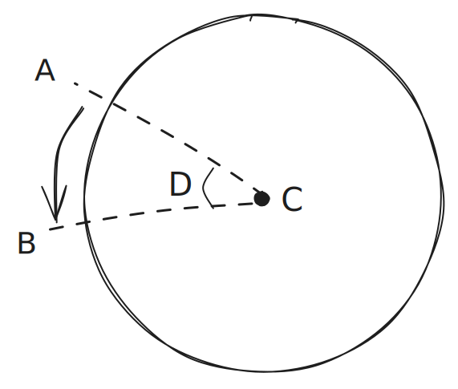
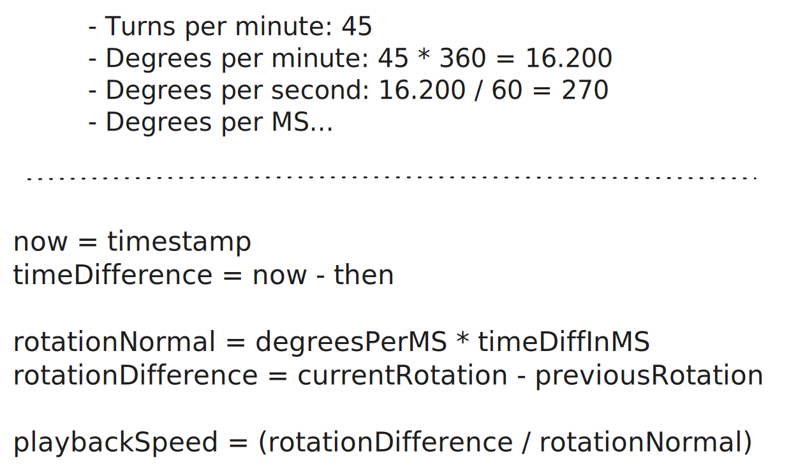
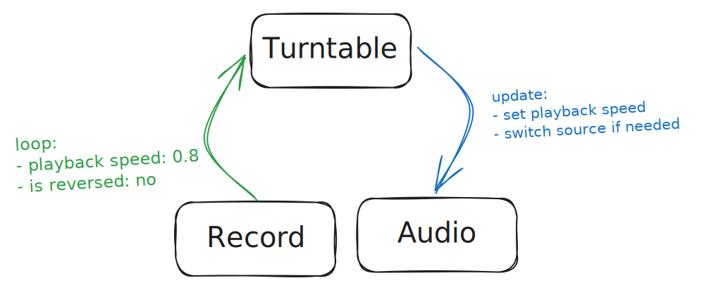

# Create a turntable with the Web Audio API

Browsers are awesome. The capabilities are almost endless with API's like WebRTC, WebGL, canvas, or the Web Audio API. This article will focus on the latter. And although it can do a lot, here I'm only going to touch the basics. Using it to control and reverse audio to create a working turntable.

The article will be in a few parts:

1.  The record: making it spin and able to drag cq. scratch
2.  The audio: loading, reversing and controlling the playback speed
3.  Tying the record to the audio
4.  Tips, tricks & improvements

_For the sake of the length of the article, the provided code blocks are simplified and are more like examples than actual implementations. Please refer to the Github repo for the actual code._
**TODO: LINK TO GITHUB REPO**

An example of what can be made: [The turntable](https://pimskie.github.io/scratch/)

## The record

A real turntable consists of a multitude of elements, but for this article, I'll focus on the record.

### What should the record do?

- Rotate: Whether "by hand" or automatically.
- Stop: When it is clicked, it should stop. Simulating a finger pressed on the record.
- Dragging: Simulating the scratching effect, going back and forth.

### The Record implementation

It should have some properties

- `angle`: a number which tracks the current rotation
- `isDragging`: whether the user is dragging the record (eg. when I'm "scratching")
- `pointerStartPosition`: a position (x, y) of the starting drag position
- `center`: a x, y position indicating the centre of the UI element

Some functions and listeners:

- `pointerup`, `pointerdown` and `pointermove` to track the dragging/scratching.
- A `loop` function called in a `requestAnimationFrame` to update the UI.

Within the `pointerdown` listener I'll indicate that the record should not rotate automatically and set the starting drag position:
**NOTE: LINK TO GITHUB FILE AND LINE**

```js
 onPointerDown(e: PointerEvent) {
  isDragging = true;

  pointerStartPosition = {
    x: e.clientX,
    y: e.clientY,
  };
}
```

```js
onPointerUp() {
  isDragging = false;
}
```

Now a little math is required to determine the angle that was dragged. Take given example image:



The user clicks on spot "A", and moves the pointer towards "B". The center of the record is at "C".  
The angle between "A" and "C", and "B" and "C" need to be calculated.  
The difference between "AC" and "BC" is "D", the angle dragged.

The three built-in functions needed for the calculations are `Math.atan2`, `Math.sin`, and `Math.cos`.
With those 2 helper functions can be made:

```JS
const angleBetween = (vec1: Vector, vec2: Vector) = Math.atan2(vec2.y - vec1.y, vec2.x - vec1.x);
const angleDifference = ({ x, y }: Vector) => Math.atan2(Math.sin(x - y), Math.cos(x - y));

onPointerMove({ x, y }) {
  const B: Vector = { x: clientX, y: clientY };

  // A stored `onPointerDown`
  const AC = angleBetween(center, A);
  const BC = angleBetween(center, B);

  const D = angleDifference({ x: AC, y: BC });

  setAngle(angle - D);
}
```

Now the only thing needed is a looping function to update the record visual:

```JS
loop() {
  if (!isDragging) {
    setAngle(angle + 0.05);
  }

  element.style.transform = `rotate(${angle}rad)`;

  requestAnimationFrame(loop);
}
```

And the result is the record spinning on its own, until the user clicks and drags it:


### Determine playback speed

The nitty gritty part: calculating the rotation speed which is also used for the playback speed.
The following data is required:

- How many turns does the record make in 1 minute (RPM)?
- How many degrees should it rotate per MS, for a playback speed of 1?
- How many MS did elapse between 2 updates?
- How many degrees did the record actually rotate?

With that data the actual playback speed can be calculated as follows:


Altering the `loop` function, it should look something like this:

```JS
loop() {
  const currentTimestamp = performance.now();
  const differenceTimestamp = currentTimestamp - previousTimestamp;

  if (!isDragging) {
    autoRotate(differenceTimestamp);
  }

  const differenceRotation = angle - previousAngle;
  const normalRotation = RADIANS_PER_MS * differenceTimestamp;
  const playbackSpeed = differenceRotation / normalRotation;

  element.style.transform = `rotate(${angle}rad)`;

  previousAngle = angle;
  previousTimestamp = currentTimestamp;

  requestAnimationFrame(loop);
}
```

Note that it calls the new function `autoRotate`:

```js
autoRotate(msElapsed: number) {
  const rotationSpeed = RADIANS_PER_MS * msElapsed;

  setAngle(angle + rotationSpeed);
}
```

So far the record can spin on its own, it can be dragged and the playback speed is calculated.  
Time to look at the audio.

## The Audio

Loading the audio is pretty straightforward using a simple `fetch`.  
The response, which will be an `ArrayBuffer`, is used to create an `AudioBuffer`. Once that is created, an `AudioBufferSourceNode` can be made which will be the actual sound source that can be controlled.

```js
const context = new AudioContext();

const response = await fetch(url);
const buffer = await response.arrayBuffer();
const audioBuffer = await context.decodeAudioData(buffer);

const source = new AudioBufferSourceNode(context);

source.buffer = audioBuffer;
source.connect(context.destination);
source.start();
```

### Setting the playback speed

Setting the playback speed is pretty easy. An `AudioBufferSourceNode` as a `playbackRate` property to control the speed:

```JS
// ✅ play at double the speed
source.playbackRate.value = 2;
```

But the value has to be positive. So to play a track in reverse isn't as simple as:

```JS
// ❌ won't work
source.playbackRate.value = -2;
```

### Reversing the audio

An audioBuffer has "channel data" which is a collection of "PCM data". Not interesting for now, but what is interesting, is the fact it is of type `Float32Array`:

```js
const channelData: Float32Array = audioBuffer.getChannelData(0);
```

And this is where the trick comes in. Like any array, a `Float32Array` can be reversed. And a new AudioBuffer can be created with a given ChannelData:

```js
// copy and reverse
const channelDataReversed = channelData.slice(0).reverse();

// create new audioBuffer with new channelData
const audioBuffer = new AudioBuffer(...)
audioBufferReversed.getChannelData(0).set(channelDataReversed);
```

> _"Is it worth it? Let me work it  
> I put my thang down, flip it and reverse it  
> Ti esrever dna ti pilf nwod gnaht ym tup i"_ - Missy Elliot

So when two audio buffers are available, they can easily be switched depending on the playback speed. For example:

```JS
const buffer = isReversed
  ? audioBufferReversed
  : audioBuffer;

const cueTime = isReversed
  ? soundDuration - timePlayed
  : timePlayed;

audioSource = new AudioBufferSourceNode(audioContext);
audioSource.buffer = buffer;
audioSource.start(0, cueTime);
```

## Tying the record to the audio

One way to structure the project is as follows:

- App
  - Record
  - Audio

Where "Record" contains all the functionality from part 1, "Audio" all the functionality from part 2, and "App" orchestrates the working.

An easy implementation is when "Record" updates (the "loop" function), it calls a callback function in "App". "App" uses the payload from the callback to update the "Audio" accordingly. See this diagram:



For example:

```JS
// Record.js
loop() {
  this.callbacks.onLoop({ speed, reversed, offset });
}
```

```JS
// App.ts
record.callbacks.onLoop = ({ speed, reversed, offset }) => {
  sampler.updateSpeed(playbackSpeed, reversed, secondsPlayed);
};
```

```JS
// Audio.ts
updateSpeed({ playbackSpeed, reversed, secondsPlayed }) {
  if (reversed !== isReversed) {
    changeDirection(reversed, secondsPlayed);
  }

  const speedAbsolute = Math.abs(playbackSpeed);

  audioSource.playbackRate.cancelScheduledValues(currentTime);
  audioSource.playbackRate.linearRampToValueAtTime(speedAbsolute, currentTime);
}
```

After making a quick "UI" representing the turntable, the final result:
[A turntable](https://pimskie.github.io/scratch/)

## Tips & tricks

### Smoother scratching

The example implementation of calculating the playback speed is rather twitchy. It is calculated every time the record is moved even 1 pixel. Meaning, 1 pixel back or forth makes the audio reverse already. Although it gives a "scratchy" sound effect already, it clearly doesn't sound very convincing.

An improvement could be to store the latest 10 dragging speeds in an array and calculate the average of those:

```JS
setPlaybackSpeed(s) {
  draggingSpeeds.push(s);

  // limit the array to 10 items, and calculate the average
  draggingSpeeds = arrayUtils.limit(draggingSpeeds, 10);
  playbackSpeed = arrayUtils.average(draggingSpeeds);

  playbackSpeed = clamp(playbackSpeed, -4, 4);
}
```
